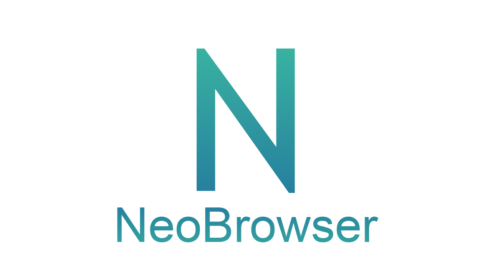

<p align="center">
  
  A simple browser made in python using PyQt5.
</p>


## Installation

Use the package manager [pip](https://pip.pypa.io/en/stable/) to install the requirements.

```bash
cd neobrowser/

pip install -r requirements.txt

python main.py
```

## Commands

```
"Ctrl + Q", toggle navbar visibility.

"Ctrl + R", reload page.

"Alt + Left_Arrow", return to last page.

"Alt + Right_Arrow", go to last page.
```

## Contributing

Pull requests are welcome. For major changes, please open an issue first
to discuss what you would like to change.

Please make sure to update tests as appropriate.

## Details
This is a project FOR FUN only, that is, it was not made for commercial uses.
